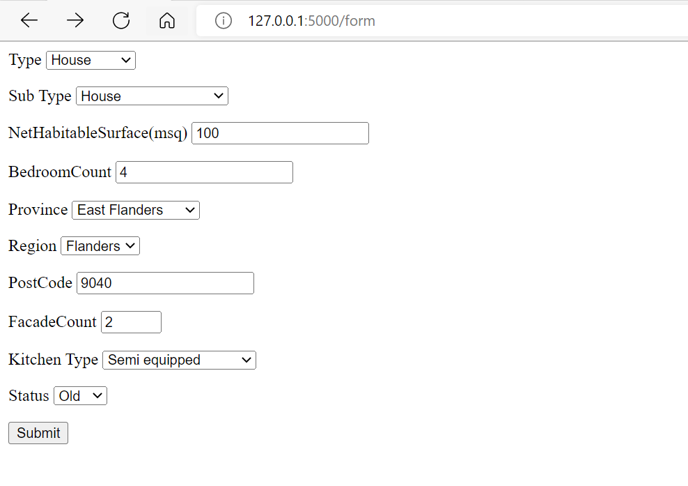
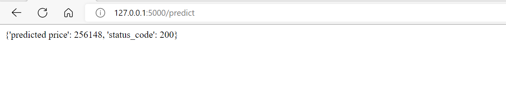

# real-estate-price-prediction
## Description
This project is built for  real estate company to predict the price of real estate sales in Belgium. first raw data is scraped from the web.And then it is cleaned and processed to create a model.

## Installation
To deploy and use the project first clone it and use the deployment

### method 1:  using a virtual enviroment

1. Install virtual environment

```
pip install virtualenv
```
2. Create virtual environment and activate inside your flask-project directory according the above structure
```
virtualenv venv
> On windows -> venv\Scripts\activate
> On linux -> . env/bin/activate
```
3. Install flask and other  library on your virtual environment with pip
```
pip install flask
pip install pandas
pip install joblib
```
4. run the app.py file
```
python app.py

```
And go to the link http://127.0.0.1:5000 from the result terminal
### method 2: using docker
 first install docker in your machine and go to the deployment directory on your terminal and type the following commands
```
docker build . -t property_predict
docker run -p 5000:5000 property_predict

```
The above command will create and run an imager for the project.

### method 3:Render
The application will be launched online soon.


## Visuals
user has to put their property characterstics in the form and 
and the model will predict the price of their property:
assets/user_form.png
assets/output_data.png


## Contributors
Amanuel Zeredawit
Arai4@becode


